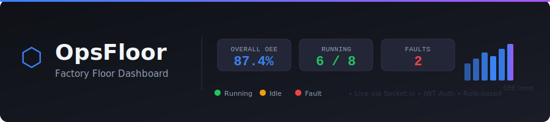

# OpsFloor — Factory Floor Dashboard

A real-time factory floor monitoring dashboard built with React, Redux Toolkit, Node.js, Express, MongoDB, and Socket.io.




---

## Features

- **Live machine telemetry** — Socket.io pushes OEE fluctuations and status changes every 5 seconds
- **Role-based access** — Operator (read-only) and Supervisor (can update machine status)
- **KPI cards** — Overall OEE, machines running/faulting, total output
- **Machine grid** — 8 cards with status badges, OEE gauges, output/target progress bars; fault cards pulse red
- **OEE trend chart** — Recharts LineChart updating live
- **Downtime Pareto chart** — Top downtime reasons by frequency
- **Shift comparison** — OEE breakdown across morning / afternoon / night shifts

---

## Prerequisites

| Requirement | Version |
|---|---|
| Node.js | 20 + |
| npm | 10 + |
| MongoDB | 7 + (running locally on port 27017) |

---

## Setup

```bash
# 1. Clone the repo
git clone <repo-url>
cd factoryFloorDashboard

# 2. Copy environment file and fill in secrets
cp .env.example .env
# Edit .env — at minimum set a strong JWT_SECRET

# 3. Install all dependencies (npm workspaces installs client + server)
npm install

# 4. Seed the database with 8 machines and 7 days of downtime logs
npm run seed

# 5. Start both server (port 5000) and client (port 5173) in parallel
npm run dev
```

Open **http://localhost:5173** in your browser.

---

## Demo Accounts

| Username | Password | Role |
|---|---|---|
| `operator` | `operator123` | Operator — read-only |
| `supervisor` | `supervisor123` | Supervisor — can update machine status |

---

## Project Structure

```
factoryFloorDashboard/
├── .claude/           # SDLC docs: ADRs, API spec, design tokens
├── client/            # React + Vite frontend
│   └── src/
│       ├── components/   # Reusable UI components
│       ├── pages/        # Route-level page components
│       ├── store/        # Redux Toolkit store + slices
│       ├── services/     # Axios API client + Socket.io singleton
│       └── hooks/        # Custom React hooks
└── server/            # Express + MongoDB backend
    └── src/
        ├── models/       # Mongoose schemas
        ├── routes/       # REST API routes
        ├── socket/       # Socket.io telemetry emitter
        └── scripts/      # Database seed script
```

---

## API Endpoints

| Method | Path | Auth | Description |
|---|---|---|---|
| POST | `/api/auth/login` | — | Login, returns JWT |
| GET | `/api/machines` | ✓ | List all machines |
| PATCH | `/api/machines/:id/status` | Supervisor | Update machine status |
| GET | `/api/downtime` | ✓ | Downtime logs (filterable) |
| POST | `/api/downtime` | ✓ | Log a downtime event |
| GET | `/api/shifts` | ✓ | Shift summaries |

---

## Socket Events

| Event | Direction | Frequency |
|---|---|---|
| `machine:update` | Server → Client | Every 5 seconds |

---

## Dataset Credit

Seed data structure based on the [Production Plant Data for Condition Monitoring](https://www.kaggle.com/datasets/inIT-OWL/production-plant-data-for-condition-monitoring) dataset published on Kaggle by inIT-OWL.

---

## Tech Stack

- **Frontend**: React 18, Vite, Redux Toolkit, React Router v6, Recharts, Socket.io-client, CSS Modules
- **Backend**: Node.js, Express 4, Mongoose 8, Socket.io 4, jsonwebtoken, bcryptjs
- **Database**: MongoDB 7
